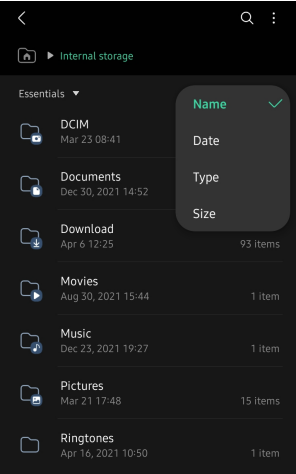

# TECHNICAL-ASSIGNMENT

## Fossil's Technical Test #1 - File Explorer

An application that allows users to quickly browse and manage the files on your mobile device.

Sample UX:

MUST HAVE features: File explorer app can display all folder, sub folder & files in these folders.
REQUIREMENT

- You can follow sample UX or feel free to apply your own design UX & UI.
- Complete all MUST HAVE features. 
- Other improvements or new features are a huge plus.
- You need to keep in mind that the app may extend its features in the near future to be fulfilled as a file explorer app so the app architecture should be scalable & flexible.
- You are free to apply all technologies, frameworks or programming languages to complete this app.